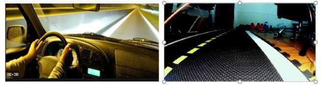

> **Elimination of Glare for Improved Lane Following** **Final Report**

**Introduction**

Present day advancements in chip design, high speed internet
technologies, cloud computing and artificial intelligence have brought
us at the doorstep of enabling the vision of self- driving cars.

However, since superior performance and metrics of reliability continue
to be the aims for further development, all possible contingencies must
be investigated before this incipient technology is commercialized. In
this regard, mitigation of glare while driving is potentially one of the
outstanding features that this technology can offer. Excessive glare due
to sunlight causes problems for drivers throughout the world. According
to assessments conducted by National Highway Traffic Safety
Administration, around 9000 glare related accidents occur every year in
the US and similar numbers have been reported in other European
countries like the UK. Since self-driving technologies are heavily
dependent on image processing conducted over the output of the cameras,
mitigation of glare is utmost importance to ensure safer performance.

The domain of optics and electromagnetics defines glare as the dazzling
and blinding effect caused in the presence of a radiating medium that
emits non-polarized light. The effect gets materialized in two ways on
roads-either by direct radiation from sun and headlight of oncoming
traffic during the night or through scattering of non-polarized
radiation from opaque and slightly polished surfaces. One outlying case
happens due to the mirage effect that is caused scattering of sunlight
due to heated lower layers of atmosphere. Since lack of polarization
happens to be a distinguishing the impression of glare continues to be
irregular in geometry regardless of the shape of the source.

In this work, conditions of glare due to scattering by the surface of
the road have been simulated and analyzed in the duckietown environment.
The goal of this work is to find ways of removing the unwanted part from
the image to allow for better performance during lane following.
Computational time and efficiency in terms of memory consumption were
the other aspects that were considered during the selection and
implementation of the proposed algorithms.

**Anti_instagram node**

The line_detector node of the duckietown architecture is used to detect
the yellow and the white lines subscribes to
anti_instagram/corrected_image/compressed topic which is published upon
by the anti_instagram node as shown in Fig.1.. The anti_instagram node
makes use of k-means clustering and convex optimization in order to
process a color balanced image that tends to offset the effects of
background lighting which may be fluorescent or yellow.


**Emulation of real time driving conditions**

In order to experimentally emulate the field of vision of the automobile
driver in the presence of glare for different conditions, a household
table lamp was used to illuminate the surface of the duckietown mats. By
varying the relative orientation of the duckiebot and the former the
following conditions were successfully realized.

Glare due to headlights during the night



Glare due to overhead street-lights


> Glare due to sunlight falling partly wet/polished surface
>
> 
>
> **Problem**
>
> Improving the accuracy of the line_detection node by optimizing the
> output of the lane detection node turned out be one the major
> challenges of this work. Other parameters of consideration included
> optimization of computational time and memory, universality of the
> algorithm.
>
> Following are some of the faulty line detection images that have been
> traced using edge detection on inputs that have glare on the surface.

Color Detection


Edge Detection

> 
>
> **Contour Detection**
>
> One of the pivotal features of the algorithms presented in this work
> is the successful detection and separation of glare in the form of
> unwanted contours from the input image.


```python
cv2.findContours() and cv2.drawContours() 
```

function have been used in our
conditional analysis for this purpose.

**First Method for Glare Removal**

Our first method for glare removal employs a dual canny edge detection
strategy. The main objective here is to isolate the road lines and
eliminate the glare, while avoiding the use of color filtering. Any use
of color filtering would likely fail to remove the glare, as the lights
we used for our test cases are the same color as the lines that we wish
to keep. The original image arrives, which, in the case of our test
cases, includes a large patch of false edges on the road.


These false edges are caused by the glare of light on the road, which
changes the color that the camera perceives and tricks any edge
detection in thinking there is an edge between the light glare and the
dark road. When our program receives an image, it immediately uses a
function which draws dark contour lines around all edges in the picture.
This is the first stage of canny edge detection. The resultant image has
most of its light glare now covered by the dark contours.


These contours are indiscriminate and outline all edges. Unfortunately,
the artificial contours still produce some false edges against the
original road. Some white pixels that escaped the dark contouring are
also visible. To fix this, the image is slightly blurred before the
second canny edge detection is applied.


The blur itself is very subtle, as we wish to keep the features of the
lines accurate. It is enough to smooth out both the stray white pixels
and the sharpness of the contours against the road. The edge detection
now sees no false edges, producing only the outlines of the lines that
actually exist.


Next, the original lines must be added back. This can easily be done
with a bitwise AND function, but that would require the canny outlines
to be filled in with white. First, the outlines are dilated to: A)
strengthen outline, removing any possible gaps, and B) replenish the
parts of the line that were originally removed by the dark contours.
Then, we use the CV2 morphological transformation "Closing" to fill in
the lines. We configured the transformation to work in this way: if two
white pixels exist horizontally from each other, within a certain range
(such as from one side of a line to the other), the black space between
them is filled with white. The range, however, is lot large enough to
fill from one side of the road to the other. It is not implemented
vertically. In this way, the transformation fills the road's lines like
scanlines on a cathode ray television.


Now, the filled lines can be put into a bitwise AND function with the
original (unblurred, un-contoured) image and our final output is
achieved: the original road lines on a pitch-black, glare-less road.

.


While this method of glare detection is well suited for most cases it
may sometimes consume more computational time because of which there may
be delay between incremental motion of the robot and the processing
speed since it involves cycles of blurring and edge detection. However,
it is best suited when used for a customized line detecting node since
the results are skewed for very limited number of cases.

**Second Method for Glare Removal**

While the second method for glare removal also depends upon contour
detection, the strategy used here simply involves removing the contours
or areas of glare from the input image while preserving all the
remaining details in it. The second method is designed to provide room
for further addition of functionality line terrain assessment from the
output obtained from it.

Using contour detection on the grayscale image, all irregular contours
having less area and irregular shape are extracted in a mask image.

Sample Mask Image

> 
> 
This mask image is in turn used to create black regions to replace glare
in the input image by the use bitwise_not and bitwise_and operators. The
following step involves filling in the black regions with test colors of
choice.

**Testing**

When the threshold area for detecting of unwanted contours limited to 80
units and the number of vertices for detecting unwanted shapes is kept
at more than 5 the following results are obtained.

{width="6.5in"
height="2.4763888888888888in"}

{width="6.5in"
height="2.3138877952755905in"}

{width="6.5in"
height="2.286111111111111in"}

With enhanced degrees of freedomas far as the tunable parameters are
concerned-threshold intensity for edge detection, threshold area and
vertices for contour detection this method provides a trade-off between
computational time and accuracy while preserving the remaining details
of the image.

**Types of Noises and their effects during Image processing**

**Types of digital images:**

> •Binary Images
>
> •Gray Scale Images
>
> •Color Images

Noise is always presenting in digital images during image acquisition,
coding, transmission, and processing steps. It is very difficult to
remove noise from the digital images without the prior knowledge of
filtering techniques.

{width="5.983333333333333in"
height="3.1666655730533684in"}

**Sources of Image noise:**\
1.While image being sent electronically from one place to another.

> 2.**Sensor heat** while clicking an image.
>
> 3.With varying **ISO Factor** which varies with the capacity of camera
> to absorb light.

**Gaussian Noise:**\
Gaussian Noise is a statistical noise having a probability density
function equal to normal distribution, also known as Gaussian
Distribution. Random Gaussian function is added to Image function to
generate this noise. It is also called as electronic noise because it
arises in amplifiers or detectors. Source: thermal vibration of atoms
and discrete nature of radiation of warm objects.

**Types of Impulse Noise:**\
1.**Salt Noise:** Salt noise is added to an image by addition of random
bright with pixel value 255 in different parts over the image randomly.

> 2.**Pepper Noise:** Salt noise is added to an image by addition of
> random dark with pixel value of zero all over the image.

3.**Salt and Pepper Noise:** Is added to an image by addition of both
random bright with pixel value of 255 and random dark with pixel value
of 0 all over the image. This model is also known as data drop noise
because statistically it drops the original data values **Poisson
Noise:**\
The appearance of this noise is seen due to the statistical nature of
electromagnetic waves such as x-rays, visible lights and gamma rays.

**Speckle Noise:**\
Speckle is a granular noise that inherently exists in an image and
degrades its quality. Speckle noise can be generated by multiplying
random pixel values with different pixels of an image.

We Investigated the effects of **Gaussian noise** .It is a type of
**noise** model used in information theory to mimic the effect of many
random processes that occur in nature.

We specifically investigated the effects of Gaussian noise on image
filtering techniques. Since all these Noises pose challenges to image
processing techniques, we ran some experiments on one of the filtering
techniques which use contour-based elimination of noise due to glare.

Contour Elimination from step 2 is used to create a new corrected image
with the glare found.

The glare is found as a mask which is then coverted to white pixels and
superimposed onto the same image which yields the results below.

{width="4.725in"
height="3.3333333333333335in"}

**Image showing the detected glare**

We introduced Gaussian Noise before the creation of a color balanced
image and then it is subject to contour elimination. And the contour
elimination eliminates glare it is published on the image_with_lines
topic which is then subject to lane detection using the default
Duckietown code.

The results image of Lane detection from Duckietown code with using the
second method of the glare elimination with a high amount of Gaussian
noise is attached below.

{width="5.866666666666666in"
height="3.475in"}

Mean = 35 ,Variance = 35 and Sigma = variance0.5

{width="5.875in"
height="3.6999989063867016in"}

Mean = 0.1 Variance = 0.1

**Images showing the improvement in Lane detection with reducing trend
of Gaussian Noise.**

{width="6.5in"
height="3.0638877952755905in"}

> {width="5.1819444444444445in"
> height="2.640277777777778in"}

Although the findings are not very concrete they prove the fact that
there is some accuracy in elimination of the glares as variance of 0.1
may correspond to the nature of the duckietown surface and also the
effect of non-polarized radiation.

**Conclusion**

While the first method performs better in terms of accuracy the second
method achieves a trade off between accuracy, computational time and
preservation of details that can be utilized for added on features.
However, if the overall line_detection node is to be modified with a
more robust and applicable strategy, first method happens to be the go
to option since it already conducts similar processes of edge detection
as carried out by the line_detector node and that is where the scope of
further work lies. Some work for improvisation can also be conducted to
mitigate jingling effects in the output images from these nodes. One of
the possible solutions may be variation of the frame rate which however,
may come at the expense of overall speed of response and thereby
requiring the duckiebot to slow down.
